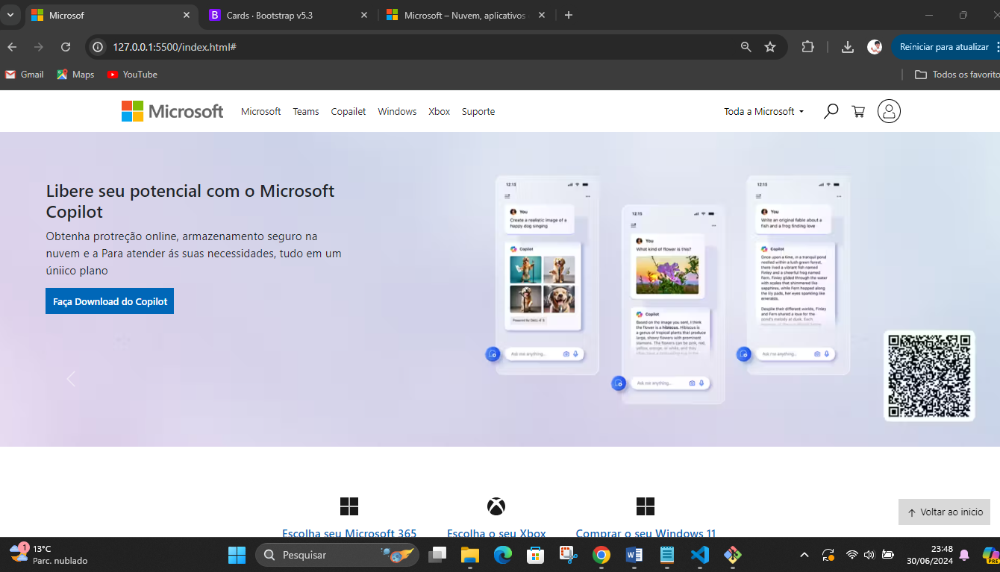

1. 

# Site da Microsoft Clone
Esse site foi um clone do site da microsoft para mostrar que com poucas ferramentas podemos criar qualquer site

### 👨‍💻 Tecnologias usadas
**Front-end:**
 - HTML 5;
 - CSS3, FLEX BOX;
 - BOOTSTRAP 5

### 🙋 Autores / Colaboradores
* **DevClub** - *Ideia do projeto* - [Rodolfo](https://www.youtube.com/@canaldevclub)
* **jailson dev** - *FrontEnd do projeto* - [jailson Dev](https://www.youtube.com/@JailsonDev/videos)

### 🔗 Licença
[Testar o Site](https://radiant-dango-a31833.netlify.app/)

Esse projeto está sob a licença (nome da licença) - acesse os detatlhes [LICENSE.md](www.google.com).

### 🫂 Gratidão agradecimentos
- Obrigado por acompanha o meu projeto até aqui.
- Email de contato para: __jailson.nogueira2@gmail.com__
- WhatsApp: __159 8819-6147__
- LinkeDin: [meu_linkedin](https://www.linkedin.com/in/jailsonn-silva/)

